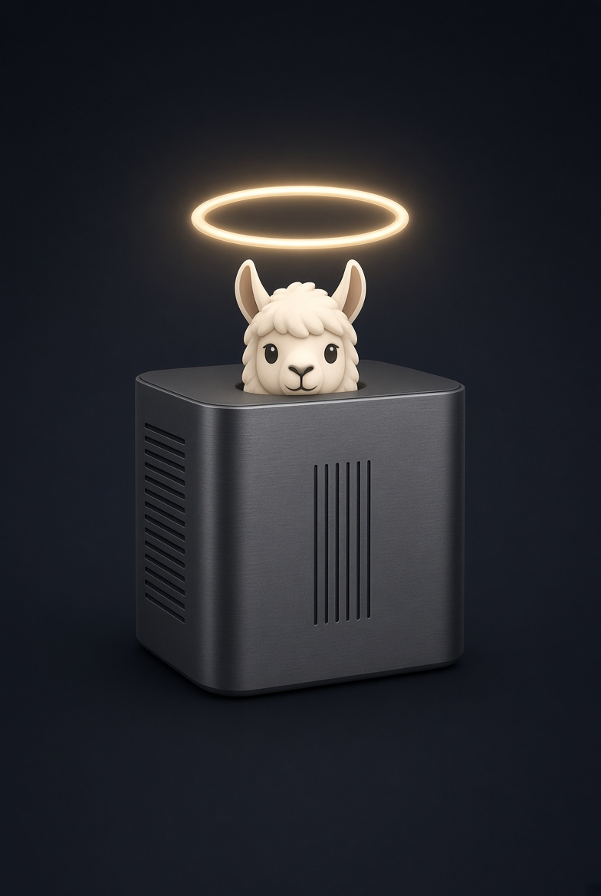

## Halo Box




Community fork of llama.cpp

The goal is simple: more functionality, and the fastest llama.cpp around. And help the community with a single fast llama.cpp fork instead of 
many competing ones.

Halo Box keeps two forks, and which one you want depends on your hardware:

| Fork | What it is |
| --- | --- |
| [halo-box/llama.cpp](https://github.com/halo-box/llama.cpp) (this repo) | Stays close to mainline. Tracks upstream `master` and adds features and speedups on top, without diverging from how upstream works. |
| [halo-box/strix-llama.cpp](https://github.com/halo-box/strix-llama.cpp) | Purely optimised for AMD Strix Halo machines (Ryzen AI Max+, RDNA 3.5 / gfx1151). Free to diverge from upstream wherever that buys speed. |

Use this repo if you want upstream behaviour plus extras. Use `strix-llama.cpp` if you run a Strix Halo box and
want every last token/s out of it.

Upstream behaviour is unchanged - this is a superset, not a rewrite. On top of it, this fork carries:

- **Speculative prefill** (`--spec-prefill`) - a small draft model scores prompt tokens by attention importance so
  the target model only prefills the ones that matter, cutting time-to-first-token on long prompts.
- **MTP draft head for speculative decoding** - use a model's own multi-token-prediction head as the draft model,
  instead of loading a second model alongside it.
- **N-gram table on disk** (`--ngram-on-disk`) - keeps a model's n-gram hash-embedding table (28.8 GB on
  Qwen3.8-Flash-Next) off the memory budget entirely, reading only the rows each batch actually gathers.
- **Vulkan fixes and tuning for RDNA 3.5** - driver-gated coopmat LDS stride padding, UMA bulk readback gated on
  host-cached mappings, IQ3_S mat-vec at batch sizes > 4, and a radix top-k kernel.
- **A `hidden` server preset option** - keep a model loadable by name while omitting it from `GET /models`.
- **`LLAMA_GRAPH_TIMING=1`** - report where the CPU time of a decode actually goes (graph build, alloc, inputs).

Work lands on `halo/*` branches, and upstream is merged in regularly. Anything generally useful is sent upstream;
what stays here is either not yet ready to go up, or too niche for mainline.


# llama.cpp


<div align="center">

<b>LLM inference in C/C++</b>

[](https://opensource.org/licenses/MIT)
[](https://github.com/ggml-org/llama.cpp/releases?q=tag:v0)
[](https://github.com/ggml-org/llama.cpp/releases?q=b)
[](https://github.com/ggml-org/llama.cpp/actions/workflows/server.yml)
[](https://github.com/ggml-org/llama.cpp/actions/workflows/docker.yml)
[](https://github.com/ggml-org/llama.cpp/actions/workflows/winget.yml)

[ggml](https://github.com/ggml-org/ggml) / [ops](https://github.com/ggml-org/llama.cpp/blob/master/docs/ops.md) / [maintainer PRs](https://github.com/ggml-org/llama.cpp/issues?q=is%3Apr%20is%3Aopen%20draft%3AFalse%20(author%3Argerganov%20OR%20author%3AKitaitiMakoto%20OR%20author%3Adanbev%20OR%20author%3Aaldehir%20OR%20author%3Amax-krasnyansky%20OR%20author%3ACISC%20OR%20author%3Aggerganov%20OR%20author%3Aam17an%20OR%20author%3Abartowski1182%20OR%20author%3Anikwen%20OR%20author%3Ahipudding%20OR%20author%3AServeurpersoCom%20OR%20author%3Apwilkin%20OR%20author%3Areeselevine%20OR%20author%3Angxson%20OR%20author%3Ajeffbolznv%20OR%20author%3Amarty1885%20OR%20author%3A0cc4m%20OR%20author%3ATitaniumtown%20OR%20author%3Aangt%20OR%20author%3AIMbackK%20OR%20author%3Aarthw%20OR%20author%3AJohannesGaessler%20OR%20author%3AORippler%20OR%20author%3Aruixiang63%20OR%20author%3Axctan%20OR%20author%3Aallozaur%20OR%20author%3Ayomaytk%20OR%20author%3Aaendk%20OR%20author%3Agaugarg-nv%20OR%20author%3Ataronaeo%20OR%20author%3Aforforever73%20OR%20author%3Alhez%20OR%20author%3Anetrunnereve%20OR%20author%3Afairydreaming)%20sort%3Aupdated-desc) / [dev stats](https://github.com/ggml-org/llama.cpp-dev) / [lib llama API](https://github.com/ggml-org/llama.cpp/issues/9289) / [llama-server REST API](https://github.com/ggml-org/llama.cpp/issues/9291)

</div>

## Quick start

A few options to get `llama.cpp` installed on your machine:

- Visit https://llama.app and follow the instructions
- Run with Docker - see our [Docker documentation](docs/docker.md)
- Download pre-built binaries from the [releases page](https://github.com/ggml-org/llama.cpp/releases)
- Build from source by cloning this repository - check out [our build guide](docs/build.md)

Once installed:

```sh
# Download and run a model directly from Hugging Face
llama cli -hf ggml-org/Qwen3.5-0.8B-GGUF

# Launch OpenAI-compatible API server
llama serve -hf ggml-org/Qwen3.5-0.8B-GGUF
```

<table align="center">
    <tr>
        <td align="center" width=50%>
            
            <i>VLM session with <b>llama cli</b></i>
        </td>
        <td align="center">
            
            <i>Built-in web UI against <b>llama serve</b></i>
        </td>
    </tr>
<table>

## Running Qwen3.8 Flash Next

Qwen3.8-Flash-Next (arch `qwen4exp`) carries an n-gram hash-embedding table, `per_layer_token_embd`:
320M rows of 90 bytes, 28.8 GB, about a third of the model's bytes. One token gathers 16 of those rows
at unrelated hashed offsets, so the working set is only a few thousand rows per batch. Keeping the whole
table resident spends RAM that the weights and the KV cache need more - on a unified-memory box they all
compete for the same pool.

`--ngram-on-disk` leaves the table in the GGUF file. The tensor is created but never allocated, mapped or
loaded; each ubatch `pread`s exactly the rows it gathers and hands them over dequantized:

```sh
llama-server -m Qwen3.8-Flash-Next-IQ4_XS.gguf --ngram-on-disk
```

At load the model reports what it decided - the file and offset it will read from, the row count, row width
and type, bytes per row and total size on disk, then the I/O mode, reader threads and row cache:

```
load_arch_tensors: PLE n-gram table stays on disk: <file> @ <offset>: <rows> rows x <ne0> <type>
(<bytes> B/row, <size> GiB), direct I/O, 64 threads, row cache 256 MiB
```

### Tuning

| Flag | Default | What it does |
| --- | --- | --- |
| `--ngram-on-disk` | off | keep the table on disk instead of in memory |
| `--ngram-io-threads N` | 64 | parallel readers. Random 4 KiB reads need queue depth to saturate an NVMe: the drive these defaults came from does 62k IOPS at 16 threads, 130k at 64, and about 160k at 128+ |
| `--ngram-cache MiB` | 256 | direct-mapped cache of raw rows, `0` disables it |
| `--ngram-direct-io`, `--no-ngram-direct-io` | on | read with `O_DIRECT` so the rows do not land in the page cache either. Falls back to buffered reads with a warning if the `O_DIRECT` open fails |

Each has an `LLAMA_ARG_*` environment equivalent (`LLAMA_ARG_NGRAM_ON_DISK` and so on).

The defaults assume NVMe. On a slower device, raise `--ngram-cache` and lower `--ngram-io-threads`; if the
table lives on a filesystem that does not support `O_DIRECT`, pass `--no-ngram-direct-io` to skip the
failed open.

### MTP speculative decoding

The model ships a multi-token-prediction head, which this fork can drive as the draft model instead of a
second full model. Point `-md` at the MTP GGUF:

```sh
llama-server -m Qwen3.8-Flash-Next-IQ4_XS.gguf --ngram-on-disk \
             --spec-type draft-mtp -md Qwen3.8-Flash-Next-MTP-Q8_0.gguf
```

With `-hf`, `--spec-type draft-mtp` also makes the downloader pick the MTP sidecar out of the same repo,
and the type is inferred automatically when such a sidecar is present.

### Notes

- `--ngram-on-disk` is a no-op on any other architecture. Only `qwen4exp` has this table.
- The flag crashed on every model before commit `bb10d0834`. Anything older needs that fix first.

## Hiding a model from GET /models

Running llama-server in router mode, the INI preset file takes one extra option this fork adds: `hidden`.

```ini
; only useful as a draft model, keep it out of the picker
[ggml-org/MY-MODEL-MTP-GGUF:Q4_K_M]
hidden = 1
```

A model marked `hidden = 1` is left out of `GET /models` and `GET /v1/models`. It can still be loaded and used
by requesting it by name - this only changes what appears in listings, such as the model picker in the web UI.

It earns its keep on entries that are discovered rather than chosen. llama-server picks models up from the HF
cache and from `--models-dir` on its own, so a draft or MTP GGUF lands in the picker next to the real models
even though nobody would ever chat with it. A preset section whose name matches an existing model merges into
that entry instead of creating a new one, so the stub above is all it takes to hide something that arrived
from the cache.

Do not set `hidden` in the `[*]` section: it applies to every preset and empties the list.

The other preset-only options are documented under [Model presets](tools/server/README.md#model-presets).

## Description

The main goal of `llama.cpp` is to enable LLM (and VLM) inference with minimal setup and state-of-the-art performance on
a wide range of hardware - locally and in the cloud.

- Plain C/C++ implementation without any dependencies
- Apple silicon is a first-class citizen - optimized via ARM NEON, Accelerate and Metal frameworks
- AVX, AVX2, AVX512 and AMX support for x86 architectures
- RVV, ZVFH, ZFH, ZICBOP and ZIHINTPAUSE support for RISC-V architectures
- 1.5-bit, 2-bit, 3-bit, 4-bit, 5-bit, 6-bit, and 8-bit integer quantization for faster inference and reduced memory use
- Custom CUDA kernels for running LLMs on NVIDIA GPUs (support for AMD GPUs via HIP and Moore Threads GPUs via MUSA)
- Vulkan and SYCL backend support
- CPU+GPU hybrid inference to partially accelerate models larger than the total VRAM capacity

The `llama.cpp` project is build on top of the [ggml](https://github.com/ggml-org/ggml) library.

## Supported backends

| Backend | Target devices |
| --- | --- |
| [BLAS](docs/build.md#blas-build) | All |
| [BLIS](docs/backend/BLIS.md) | All |
| [CANN](docs/build.md#cann) | Ascend NPU |
| [CUDA](docs/build.md#cuda) | Nvidia GPU |
| [HIP](docs/build.md#hip) | AMD GPU |
| [Hexagon [In Progress]](docs/backend/snapdragon/README.md) | Snapdragon |
| [IBM zDNN](docs/backend/zDNN.md) | IBM Z & LinuxONE |
| [MUSA](docs/build.md#musa) | Moore Threads GPU |
| [Metal](docs/build.md#metal-build) | Apple Silicon |
| [OpenCL](docs/backend/OPENCL.md) | Adreno GPU |
| [OpenVINO [In Progress]](docs/backend/OPENVINO.md) | Intel CPUs, GPUs, and NPUs |
| [RPC](https://github.com/ggml-org/llama.cpp/tree/master/tools/rpc) | All |
| [SYCL](docs/backend/SYCL.md) | Intel GPU |
| [VirtGPU](docs/backend/VirtGPU.md) | VirtGPU APIR |
| [Vulkan](docs/build.md#vulkan) | GPU |
| [WebGPU](docs/build.md#webgpu) | All |
| [ZenDNN](docs/build.md#zendnn) | AMD CPU |

## Documentation

#### Tools

- [cli](tools/cli/README.md)
- [completion](tools/completion/README.md)
- [server](tools/server/README.md)
- [GBNF grammars](grammars/README.md)

#### Development

- [How to build](docs/build.md)
- [Running on Docker](docs/docker.md)
- [Build on Android](docs/android.md)
- [Multi-GPU usage](docs/multi-gpu.md)
- [Performance troubleshooting](docs/development/token_generation_performance_tips.md)
- [GGML tips & tricks](https://github.com/ggml-org/llama.cpp/wiki/GGML-Tips-&-Tricks)
- [XCFramework](docs/xcframework.md)
- [Completions](docs/completions.md)
- [Models](docs/models.md)
- [Release process](docs/release.md)

## Contributing

- Contributors can open PRs
- Collaborators will be invited based on contributions
- Maintainers can push to branches in the `llama.cpp` repo and merge PRs into the `master` branch
- Any help with managing issues, PRs and projects is very appreciated!
- Read the [CONTRIBUTING.md](CONTRIBUTING.md) for more information

## Acknowledgements

- [yhirose/cpp-httplib](https://github.com/yhirose/cpp-httplib) - Single-header HTTP server, used by `llama-server` - MIT license
- [nothings/stb](https://github.com/nothings/stb) - Single-header image format decoder, used by multimodal subsystem - Public domain
- [nlohmann/json](https://github.com/nlohmann/json) - Single-header JSON library, used by various tools/examples - MIT License
- [mackron/miniaudio](https://github.com/mackron/miniaudio) - Single-header audio format decoder, used by multimodal subsystem - Public domain
- [sheredom/subprocess.h](https://github.com/sheredom/subprocess.h) - Single-header process launching solution for C and C++ - Public domain
